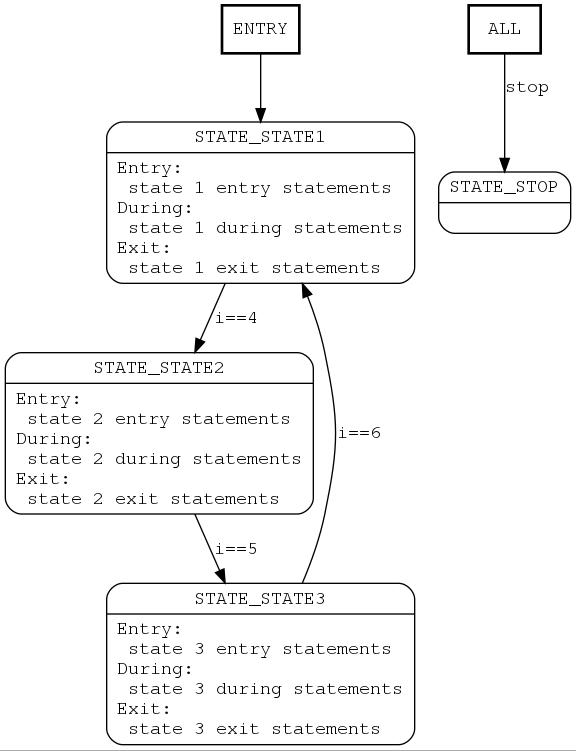

# Implementation of MACRO based Finite State Machine (FSM)

This code implements a macro based finite state machine. Purpose of this implementation is to have a fsm that can be graphed for easy visualization.

## Usage

- Include "fsm.h" in project
- Create states enum with all states
- Create fsm_t object and define FSM_STRCT as name of the structure
- Create fsm init() and step() functions
- Initialize the fsm in init() by calling FSM_INIT with entry state
- Create fsm in step with BEGIN_FSM and END_FSM
- Fill up fsm with BEGIN_STATE/END_STATE for every state
- Fill up ENTRY/DURING/EXIT and EVENT on any state that needs it
- Compile and run!

## More details

- All elements within the state machine are optional: ENTRY / DURING / EVENT / EXIT
- Keep the following order within a STATE block: ENTRY / DURING / EVENT / EXIT
- When using multiple EVENT blocks, the first one to pass the test will be executed, the rest within the case will be ignored
- It is possible to add an EVENT block before BEGIN_FSM. This can be used to change to a particular state before running the machine
- This is an EVENT driven machine, do not change state variables or flags. Let the macros do the work.

## Graphing the state machine

The main reason to have a macro implementation of a state machine is that the macro code can be easily parsed and extracted. This project contains a parser that will generate a 'dot' file to be graphed by 'graphviz' command:

[https://github.com/mfilippa/fsm_graph](https://github.com/mfilippa/fsm_graph)

The example below can be graphed by running:
```
$ smgraph main.c fsm.dot
$ dot -Tjpg fsm.dot -o fsm.jpg
```

The result is the following:



The file generated by script is the following:

```
digraph G {
    node [shape=box,fontname=courier];
    ENTRY [label="ENTRY"];
    ENTRY -> STATE_STATE1;
    STATE_STATE1 [label="=== STATE_STATE1 ===\nEntry:\l  state 1 entry statements\lDuring:\l  state 1 during statements\lExit:\l  state 1 exit statements\l"];
    STATE_STATE2 [label="=== STATE_STATE2 ===\nEntry:\l  state 2 entry statements\lDuring:\l  state 2 during statements\lExit:\l  state 2 exit statements\l"];
    STATE_STATE3 [label="=== STATE_STATE3 ===\nEntry:\l  state 3 entry statements\lDuring:\l  state 3 during statements\lExit:\l  state 3 exit statements\l"];
    STATE_STOP [label="=== STATE_STOP ===\n"];
    ALL [label="ALL"];
    ALL -> STATE_STOP [fontname=courier,label="stop"];
    STATE_STATE1 -> STATE_STATE2 [fontname=courier,label="i==4"];
    STATE_STATE2 -> STATE_STATE3 [fontname=courier,label="i==5"];
    STATE_STATE3 -> STATE_STATE1 [fontname=courier,label="i==6"];
}
```

## Implementation example

```
// include fsm macro
#include "fsm.h"


// enumerate states
enum states_enum {
    STATE_STATE1,
    STATE_STATE2,
    STATE_STATE3,
    STATE_STOP,
};

// fsm structure
fsm_t fsm;
#define FSM_STRCT fsm

// prototypes
void fsm_init(void);
void fsm_step(void);

// -----------------------------------------------------------------------------
// main
// -----------------------------------------------------------------------------
int i,j;
int stop;
int main(void){
    stop=0;
    fsm_init();
    for (j=0; j<50; j++) {
        if (j==40) stop=1;
        fsm_step();
    }
    return 0;
}

// -----------------------------------------------------------------------------
// sm init
// -----------------------------------------------------------------------------
void fsm_init(void){
    FSM_INIT(STATE_STATE1);
}

// -----------------------------------------------------------------------------
// sm step
// -----------------------------------------------------------------------------
void fsm_step(void){

    BEGIN_EVENT(stop,STATE_STOP);
    END_EVENT;
    
    BEGIN_FSM;

        BEGIN_STATE(STATE_STATE1);

            BEGIN_ENTRY;
                // state 1 entry
                printf("Entry STATE_STATE1 i=%u\n",i);
            END_ENTRY;

            BEGIN_DURING;
                // state 1 during
                i++;
                printf("During STATE_STATE1 i=%u\n",i);
            END_DURING;
            
            BEGIN_EVENT(i==4,STATE_STATE2);
                // state 1 event
                printf("Event STATE_STATE1 i=%u\n",i);
            END_EVENT;
            
            BEGIN_EXIT;
                // state 1 exit
                printf("Exit STATE_STATE1 i=%u\n",i);
                i = 0;
            END_EXIT;

        END_STATE;

        BEGIN_STATE(STATE_STATE2);
            
            BEGIN_ENTRY;
                // state 2 entry
                printf("Entry STATE_STATE2 i=%u\n",i);
            END_ENTRY;
            
            BEGIN_DURING;
                // state 2 during
                i++;
                printf("During STATE_STATE2 i=%u\n",i);
            END_DURING;
            
            BEGIN_EVENT(i==5,STATE_STATE1);
                // state 2 event 1
                printf("Event STATE_STATE2 i=%u\n",i);
            END_EVENT;

            BEGIN_EVENT(stop,STATE_STOP);
                // state 2 event 2
                printf("Stop event\n");
            END_EVENT;
            
            BEGIN_EXIT;
                // state 2 exit
                i=0;
                printf("Exit STATE_STATE2 i=%u\n",i);
            END_EXIT;

        END_STATE;

        BEGIN_STATE(STATE_STATE2);
            
            BEGIN_ENTRY;
                // state 2 entry
                printf("Entry STATE_STATE2 i=%u\n",i);
            END_ENTRY;
            
            BEGIN_DURING;
                // state 2 during
                i++;
                printf("During STATE_STATE2 i=%u\n",i);
            END_DURING;
            
            BEGIN_EVENT(i==6,STATE_STATE1);
                // state 2 event 1
                printf("Event STATE_STATE2 i=%u\n",i);
            END_EVENT;

            BEGIN_EVENT(stop,STATE_STOP);
                // state 2 event 2
                printf("Stop event\n");
            END_EVENT;
            
            BEGIN_EXIT;
                // state 2 exit
                i=0;
                printf("Exit STATE_STATE2 i=%u\n",i);
            END_EXIT;

        END_STATE;

        BEGIN_STATE(STATE_STOP);

        END_STATE;

    END_FSM;
}
```


